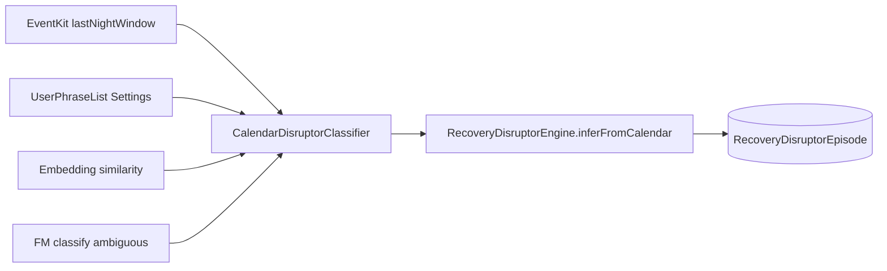

# V3 M7 handoff: Calendar-informed recovery disruptors (alcohol-first)

## Owner problem

User tags alcohol via **"Drank last night"** on Dashboard (V3 M6). That works but is easy to forget. User already logs social drinking in **Apple Calendar** with varied titles ("pub night", "dinner with X", etc.). Coach does not connect calendar to disruptors today.

**Expectation:** App learns from calendar (and optionally user phrase hints) to infer alcohol/social-disruptor episodes without requiring the same title every time. On-device only; no cloud.

## Current state (do not re-build)

| Piece | Status |
|-------|--------|
| `RecoveryDisruptorEpisode` + `RecoveryDisruptorEngine` | Shipped V3 M6 |
| User tag `tagAlcoholLastNight` | `startDay = yesterday`, confidence 1.0 |
| Health proxy inference | Short sleep + elevated RHR + suppressed HRV; training load wins over alcohol |
| `CalendarEventStore` (EventKit) | Exists; used for Coach schedule + Train busy chip |
| `CalendarLookahead` | **Forward only** (today + 7 days). Yesterday events never fetched |
| Calendar → disruptor | **Not wired** |
| Retroactive tag prompts | **Not implemented** (no "did you drink last Tuesday?" UI) |

Relevant files:
- `Signal/Signal/Data/Calendar/CalendarEventStore.swift`
- `Signal/Signal/Data/Calendar/CalendarContextBuilder.swift`
- `Signal/Signal/Data/Recovery/RecoveryDisruptorEngine.swift`
- `Signal/Signal/Data/Recovery/RecoveryDisruptorHeuristics.swift`
- `Signal/Signal/Data/Coach/FoundationModelsCoach.swift` (on-device FM pattern)

## Goal

Nightly (and on Dashboard refresh), look at **last night's calendar events** (and optionally prior evening window). Classify whether any event is **alcohol-likely social** using a **tiered local strategy**:

1. **User phrase list** (Settings): optional strings user adds ("pub night", "beer", "wine tasting"). Exact/substring match on title + notes if notes accessible.
2. **Embedding similarity** (preferred if fast enough): compare event title to a small set of seed phrases via existing on-device embedding path (`NLEmbeddingService` / `GemmaEmbeddingService`). Threshold tunable in one constants file.
3. **Foundation Models classify** (fallback for ambiguous titles): single constrained classification call, JSON output `{ "alcoholLikely": bool, "confidence": 0-1, "reason": string }`. Gate on `isResponding`; no concurrent FM requests. Never assert "you drank" in UI below 0.75 confidence (reuse V3 M6 copy rules).

On match → upsert `RecoveryDisruptorEpisode(kind: .alcohol, source: .inferred, confidence: derived, startDay: eveningStartDay)` via existing `dedupeKey` pattern. **Never downgrade** a `userTag` episode.

Optional v1.1: if FM/embedding unavailable, phrase list + keyword seeds only.

## Non-goals

- Google Calendar / network calendars beyond EventKit on device
- Diagnosing alcohol use disorder or medical claims
- Changing recovery score formula
- Retroactive multi-week survey UI (unless trivial confirm sheet for **last night only** when calendar fires and no user tag)

## Architecture sketch

### New types (suggested)

- `CalendarDisruptorLookback` — window: prior day 18:00 → today 06:00 local (tunable)
- `CalendarDisruptorClassifier` — pure + async FM path; returns `CalendarDisruptorCandidate?`
- `UserDisruptorPhrase` — SwiftData or `UserProfile` field: `[String]` alcohol hints
- Extend `RecoveryDisruptorSource`: add `calendarInferred` OR keep `inferred` with metadata in dedupeKey prefix `calendar.alcohol.*`

### Trigger points

- `RecoveryDisruptorEngine.inferEpisodes` — after health rules, call calendar classifier if calendar authorized
- `DashboardViewModel.recompute` — ensure calendar inference runs if reflection has not (same dedupe)
- Request calendar access on Dashboard if disruptor feature enabled (mirror Coach/Train pattern)

### UI / UX

- **No daily nag** for past weeks.
- Optional **one-tap confirm** same morning: "Calendar: pub night last night. Tag as drinking?" → writes `userTag` if user confirms; dismiss = keep inferred only.
- Settings → Recovery → **"Calendar hints"** text field list (user-maintained phrases).
- Dashboard: if calendar inferred and no user tag, subtitle uses existing generic copy unless confidence ≥ 0.75.

### Coach integration

- `CoachContextBuilder.formatPersonalReadiness` already summarizes disruptors.
- Add calendar line when active: "Calendar last night: pub night (inferred alcohol-likely)."
- Do not require user to ask about calendar; include in `## Recovery` section when relevant.

## Confidence table (v1 defaults)

| Signal | Confidence |
|--------|------------|
| User phrase exact match on title | 0.85 |
| Embedding similarity ≥ threshold to seed cluster | 0.70 |
| FM alcoholLikely true | 0.55–0.75 from model score |
| FM + short sleep same night | bump +0.10 (cap 0.85) |
| User tag same night | 1.0 (unchanged) |

Prefer calendar inference vs health-only alcohol proxy when both fire same night: **higher confidence wins**; if tie, prefer calendar when title match is explicit phrase.

## Acceptance criteria

### Gate A (agent)

- Unit tests: `CalendarDisruptorClassifierTests` (phrase match, embedding mock, dedupe, no downgrade userTag)
- Integration: calendar event "pub night" yesterday → inferred alcohol episode
- `RecoveryDisruptorEngineTests` extended
- `build_sim` + `test_sim`; `build_device`

### Gate B (human, device)

| ID | Test | Pass |
|----|------|------|
| C1 | Calendar access granted; event "pub night" yesterday evening | Dashboard or logs show calendar-inferred disruptor within 1 refresh |
| C2 | User taps "Drank last night" after inference | userTag wins; undo works |
| C3 | Phrase list "beer o'clock" matches nonstandard title | Inferred without FM |
| C4 | Unrelated event "dentist" | No alcohol disruptor |
| C5 | Coach asks recovery | Response mentions calendar context when inferred |
| C6 | V3 M6 regression | Manual tag, health proxy, Train bands still work |

Console: `category:calendar`, `category:recovery`

## Human Xcode

Empty if `build_device` passes. Folder sync covers new Swift under `Signal/Signal/Signal/`. If build fails on target membership or plist keys, agent edits project files per `.cursor/rules/xcode-project-setup.mdc`.

## Implementation order

1. `CalendarDisruptorLookback` + extend `CalendarEventStore.fetchEvents` usage (backward window)
2. `UserDisruptorPhrase` storage + Settings UI (minimal)
3. `CalendarDisruptorClassifier` phrase + embedding tiers
4. Wire into `RecoveryDisruptorEngine.inferEpisodes`
5. Optional confirm sheet on Dashboard
6. Coach context line
7. Tests + `HANDOFF` + `AGENT-BUILD-UPDATES.md`

## Privacy / constraints

- iOS 26+, Swift 6, no network, no cloud calendar APIs
- Event titles stay on device; FM classification local only
- No em/en dashes in user strings
- `os.Logger` on calendar inference path

## Open question for owner (default if no answer)

**Confirm sheet vs silent infer?** Default: **silent infer** at ≥0.70 with generic UI copy; show confirm sheet only when confidence 0.55–0.69 and no user tag exists.
