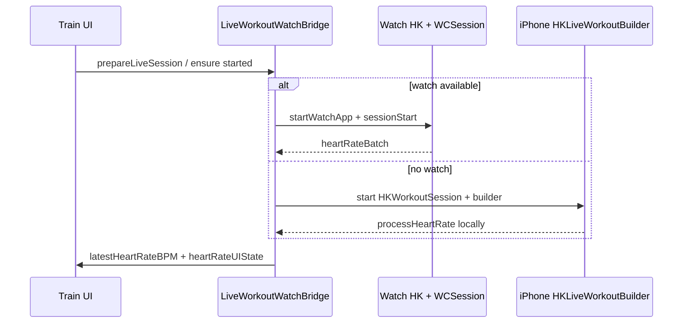

# Signal — V4 M5 — Live HR sources (watch primary, phone HealthKit fallback)

**For:** New builder agent. Read this file end-to-end before coding.

**Baseline (working, do not regress):** `main` at or after `5cddb00` (includes V4 M1 live HR repair `081573d` + summary UX). Revert reference: tag or commit `081573d` if live watch path breaks.

**Architect context:** Live Train HR on iPhone today comes from **Apple Watch** via WCSession `heartRateBatch` into `LiveWorkoutWatchBridge`. Post-workout per-set HR already uses HealthKit queries (`SetHRAttributionService`) and can include AirPods samples in Health. This milestone adds **live** HR on iPhone when **no watch path is available**, using an **iPhone `HKWorkoutSession` + `HKLiveWorkoutBuilder`** (AirPods and other HealthKit HR sources flow through that stack; no AirPods SDK).

---

## Product goal

1. **Watch available (current behavior):** Unchanged primary path. Watch runs HK workout; phone shows live BPM; phone remains single HK workout save on finish.
2. **Watch not available:** When user starts Train and watch cannot be used, start a **phone-side live workout collection** and show BPM in the same summary bar / cue pipeline.
3. **AirPods:** No separate integration. If user has AirPods Pro (or any HealthKit HR contributor) while the **phone** HK session runs, samples appear in the builder like any other phone workout HR. Do not require detecting AirPods by name.

---

## Out of scope

- Replacing watch path with Hevy-style “watch owns the only HK workout” (point 6 from prior review).
- Full refactor to HealthKit mirroring only (dropping WCSession) unless needed for fallback.
- Workout complications, cloud, network.
- Simulator fake HR (device gates only for live paths).
- Detecting “AirPods connected” in UI copy (use neutral: “Phone HR” or “HealthKit HR” in logs only).
- Editing `.pbxproj`, entitlements, plists (human owns; create Swift files under `Signal/` folder sync).

---

## When to use which source

Implement a small policy module (e.g. `LiveHeartRateSourcePolicy.swift`) tested without HK:

| Condition | Live HR source |
|-----------|----------------|
| `WCSession.isSupported()` && activated && `isPaired` && `isWatchAppInstalled` | **Watch** (existing `startWatchApp` + telemetry + ingest) |
| Else | **Phone HealthKit** live session |
| Watch becomes available mid-workout | **Do not** start phone HK session if watch path already active; if phone session started first, prefer watch once handshake completes (document choice in AGENT-BUILD-UPDATES) |

**Recommendation:** At `prepareLiveSession`, decide source once per workout. Do not flip-flop mid-session unless watch path fails for 60+ s (optional stretch; v1 can lock source at start).

---

## Architecture (target)

**Invariant (keep):** On finish, **one** HK workout saved on iPhone via existing `HealthKitWorkoutWriter`. Phone-side live session must **`discardWorkout()`** on end (same as watch), same as `WatchLiveWorkoutSessionManager.stop(discardHealthKitWorkout: true)`.

---

## Implementation tasks

### 1. Source selection + bridge refactor

- Extend `LiveWorkoutWatchBridge` (or rename to `LiveWorkoutHeartRateBridge` only if worth it; prefer minimal rename).
- `prepareLiveSession` sets `activeSessionKey` synchronously (already does).
- `ensureWatchWorkoutStarted`:
  - If watch source: existing logic.
  - If phone source: skip `startWatchApp` / `sessionStart`; call new `LiveWorkoutPhoneSessionManager.shared.start(for:configuration:)`.
- `endWatchWorkout`: stop watch telemetry **and** phone session if running.
- `ingest(messageData:)` unchanged for watch batches.
- Phone manager updates `latestHeartRateBPM` / `lastHeartRateAt` on main actor (same properties as watch ingest).

### 2. New iOS type: `LiveWorkoutPhoneSessionManager`

Mirror patterns from `SignalWatch Watch App/WatchLiveWorkoutSessionManager.swift` but on iPhone target:

- `HKWorkoutSession` + `associatedWorkoutBuilder()` + `HKLiveWorkoutDataSource`
- `HKLiveWorkoutBuilderDelegate` for heart rate
- Reuse `LiveWorkoutTelemetryThrottle` timing (1 s) for UI updates (no need to send WCSession from phone to itself)
- Authorization: reuse existing HealthKit read/workout patterns; check `HealthKitAuthorization` / entitlements already on iOS app
- Logger category: `workout`
- On failure: surface via existing `LiveWatchHeartRateUIState` chip (e.g. extend chip titles: “Health access needed for live HR”)

**Config:** `TrainWorkoutHealthKitConfiguration.make(for: session)` (already on iOS).

### 3. UI / UX (already partial)

Reuse `LiveWatchHeartRateUIState` / `WorkoutLiveSummaryBar`:

- Reserved BPM column when `isWatchWorkoutRequested` (rename to `isLiveHeartRateRequested` if phone-only).
- Status chips: extend for phone path (“Waiting for heart rate” / “HR signal lost”).
- Optional: log `live HR source=watch|phone` at info for Gate B.

Do not reintroduce romantic `heart.fill` decals; keep `LiveHeartRateDecor` ECG style.

### 4. Optional medium improvement (if time)

**Phone HK supplement when watch path stale:** If watch source selected but `lastHeartRateAt` older than 45 s and phone HK not running, start phone builder **only as fill-in** until watch batches resume. Mark as optional in handover; skip if risky.

### 5. Tests (Gate A)

- `LiveHeartRateSourcePolicyTests`: paired+installed vs not paired vs not installed (inject booleans via testable initializer, do not mock `WCSession` in XCTest if awkward).
- `LiveWatchHeartRateUITests`: extend if chip copy changes.
- Existing `LiveWorkoutTelemetryTests`, `LiveWorkoutOutboundQueueTests` must pass.
- No HK integration tests in sim required for milestone pass.

---

## Gate A (agent)

- XcodeBuildMCP `test_sim` pinned sim `id=20DDD35B-812A-49BE-9DCF-0685401ACC15`: new tests + `LiveWorkoutTelemetryTests` + `LiveWatchHeartRateUITests`.
- `build_sim` (embeds watch target compile).
- `build_device` optional; human closes live gates.

---

## Gate B (human)

| ID | Scenario | Pass |
|----|----------|------|
| **D2w** | Watch paired, Train start | BPM on phone + watch Train UI within 30 s (regression) |
| **D3w** | Same | Watch shows Train + BPM |
| **D8** | Finish on phone | Single HK workout on phone; watch session ends |
| **D2p** | Watch app **not** installed (or unpaired), Train start | BPM column appears; fills from phone/AirPods path within 60 s |
| **D2a** | No watch; **AirPods Pro** in ears during strength session | BPM updates on phone (if Apple Health shows HR for that workout) |
| **D2n** | No watch; no HR hardware | Chip explains waiting / unavailable; no crash |

Install: `./scripts/install-watch-app.sh` when watch code changes.

Console: `category:workout`, subsystem `com.cameronro.Signal`.

---

## Key files (read first)

| Area | Path |
|------|------|
| Bridge | `Signal/Data/Watch/LiveWorkoutWatchBridge.swift` |
| UI state | `Signal/Data/Watch/LiveWatchHeartRateUI.swift` |
| Summary bar | `Signal/Features/Train/WorkoutLiveSummaryBar.swift` |
| Train kickoff | `Signal/Features/Train/TrainHomeView.swift`, `ActiveWorkoutView.swift` |
| Watch reference impl | `SignalWatch Watch App/WatchLiveWorkoutSessionManager.swift` |
| HK config | `Signal/Data/Watch/TrainWorkoutHealthKitConfiguration.swift` |
| Post-workout HR | `Signal/Data/HeartRate/SetHRAttributionService.swift` |
| Finish save | `Signal/Data/HealthKit/HealthKitWorkoutWriter.swift` |
| Build log | `AGENT-BUILD-UPDATES.md` (append on completion) |

---

## Constraints (`.cursorrules`)

- iOS 26+, Swift 6, `@Observable`, no network.
- Use XcodeBuildMCP, not raw xcodebuild loops.
- Do not edit `.pbxproj`. New Swift under `Signal/Signal/...` folder sync.
- Research `@Docs` before `HKWorkoutSession` / `HKLiveWorkoutBuilder` APIs; compiler is truth.
- No em dashes in user-facing copy or `AGENT-BUILD-UPDATES.md`.
- Human commits only; end with `MILESTONE COMPLETE: V4 M5 live HR sources, READY TO COMMIT` when Gate A + Gate B pass.

---

## AirPods note for builder

AirPods Pro heart rate is **not** a separate API. During an **iPhone-hosted** `HKWorkoutSession`, HealthKit aggregates HR from available sensors (watch on wrist, AirPods, etc.) into the live builder statistics. Signal does not need an AirPods app. Post-workout, `SetHRAttributionService` already queries HK heart rate samples for the session window.

---

## Prior art comparison (do not implement Hevy clone)

| | Hevy / Strong | Signal after this milestone |
|--|---------------|-----------------------------|
| Live HR | Native watch workout mirror | Watch WCSession **or** phone HK builder |
| Saves | App-specific + Health | Phone `HealthKitWorkoutWriter` single save |
| Set HR history | In-app | HK attribution + SwiftData |

---

## Acceptance

- Watch path still passes D2/D3/D8.
- No-watch path shows live BPM when HealthKit provides samples during phone session.
- `AGENT-BUILD-UPDATES.md` entry with root design, Gate A/B, files touched.
- No regression to V4 M2 cues (still use `latestHeartRateBPM` + freshness 45 s).
